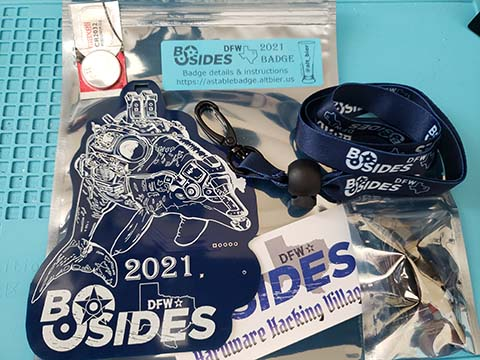
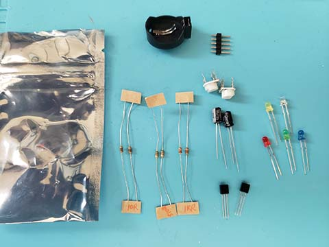

# BSidesDFW 2021 Astable Badge Kit

The Astable Badge Kit contains the following items:

*  1 - PCB
*  1 - Lanyard
*  1 - Sticker
*  1 - CR2032 Battery
*  1 - Small Static Bag with the following components:
  *  5 - 3mm LEDs (1 each of Red, Green, Blue, Yellow, and White)
  *  2 - 10 ohm Resistors
  *  2 - 510 ohm Resistors
  *  2 - 1K ohm Resistors
  *  2 - 0-30K ohm Variable Resistors (a.k.a. Rheostats)
  *  2 - 100uF Polarized Capacitors
  *  2 - NPN BJT 2222A Transistors
  *  1 - CR2031 Battery Holder
  *  1 - 5x1 header pin segment

# Instructions

This page will be updated with instructions shortly.

Please check back.
