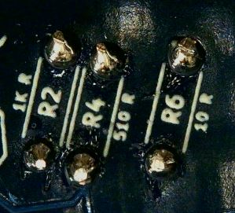
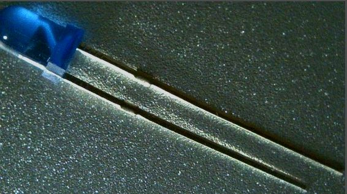

# BSidesDFW 2021 Astable Badge Kit

The Astable Badge Kit contains the following items:

*  1 - PCB
*  1 - Lanyard
*  1 - Sticker
*  1 - CR2032 Battery
*  1 - Small Static Bag with the following components:
    *  5 - 3mm LEDs (1 each of Red, Green, Blue, Yellow, and White)
    *  2 - 10 ohm Resistors
    *  2 - 510 ohm Resistors
    *  2 - 1K ohm Resistors
    *  2 - 0-30K ohm Variable Resistors (a.k.a. Rheostats)
    *  2 - 100uF Polarized Capacitors
    *  2 - NPN BJT 2222A Transistors
    *  1 - CR2031 Battery Holder
    *  1 - 5x1 header pin segment

# Tools

In addition to the badge PCB and the small component bag that is provided, you will need the following tools:

* Soldering Iron and Solder

Any electronics soldering iron in the 40 Watt to 70 Watt range should work.  
Note that not all soldering irons are for electronics, those used for plumbing and other applications use much higher temperatures that could damage electronics.

There are different types of solder used for electronics and most of them will work fine.
The type I recommend for beginner's is 63-37 (or 60-40) Rosin Core 0.8mm solder.  
The 63-37 refers to the element percentages: 63 percent Tin and 37 percent Lead.
The Rosin Core indicates that the center of the solder wire is hollowed out and filled with Rosin which is a Flux material (so you do not need to apply Flux separately).
The diameter of 0.8mm seems to work best for most applications IMHO.

You can find kits on [Amazon](https://www.amazon.com/s?k=soldering+iron+kit) and elsewhere for less than $20 that include a Soldering Iron, Solder, a Stand, and other useful items.

* Diagonal Cutter

A good diagonal cutting tool is needed to trim the component leads once soldered.
Sometimes this is provided in a soldering iron kit.
But, usually those inexpensive kits do not provide a good cutter.

You can find a good Diagonal Cutter at [Amazon](https://www.amazon.com/s?k=diagonal+cutter) and elsewhere for less than $10.

* Small Screwdriver

A small Phillips head Screwdriver is needed for adjusting the Rheostats to change the speed at which the LEDs blink.

* Multimeter and Logic Analyzer (Optional)

Testing tools such as a multimeter and logic analyzer can be useful in troubleshooting issues with your build as well as learning the electronics that make up the badge.

You can find an inexpensive Multimeter on [Amazon](https://www.amazon.com/s?k=multimeter) and elsewhere for less than $10.

You can find an inexpensive USB Logic Analyzer on [Amazon](https://www.amazon.com/s?k=usb+logic+analyzer+-+24mhz+8-channel) and elsewhere for less than $15.

# Instructions

This is a learn to solder / electronics badge.
The schematic of the circuit you will be building is printed on the back of the badge.
In addition, the back of the badge details out the placement of the components to be soldered.

All of the components that you will be soldering have through hole or THT packaging.  This means that they have metal leads that will be placed into the appropriate holes in the PCB and soldered in place.

These components can be added and soldered to the PCB in any order you wish.  These instructions will outline how I build the badge, but feel free to build as you like.

## Resistors

There are a total of six resistors, two each of the values 10 Ohm, 510 Ohm, and 1K Ohm.

The resistors come attached to paper which has the value labeled on it.  If you need to determine the value of a resistor once removed from that paper you can view the colored stripes on the body of the resistor and look it up on a resistor value chart such as this one from [wikipedia](https://en.wikipedia.org/wiki/Electronic_color_code#Resistors).

Identify the area on the badge where the components will need to be installed by looking at the component labels on the back of the PCB.

Remove the resistors from the paper and bend their leads 90 degrees.

Insert the resistors into the proper holes as labeled on the back of the PCB.

The resistor body should be on the front of the PCB with the leads coming through the holes to the back of the PCB.

Solder those leads in place.

Trim the leads with a diagonal cutter taking care not to trim too close to the solder joint.

## Transistors

There are two NPN BJT Transistors of the model 2222A.  

Identify the area on the badge where the components will need to be installed by looking at the component labels on the back of the PCB.

These Transistors have a flat side and a rounded side to allow for proper alignment when placing on the PCB.

Insert the Transistors into the proper holes as labeled on the back of the PCB.

The Transistor body should be on the front of the PCB with the leads coming through the holes to the back of the PCB.

Solder those leads in place.
The holes for these components are close together.
Be careful not to bridge (solder together) any of the Transistor connections.

Trim the leads with a diagonal cutter taking care not to trim too close to the solder joint.

## Rheostats (Variable Resistors)

There are two Variable Resistors also known as Rheostats which each have 3 pins and a resistance range of 0 to 30K Ohms.

Identify the area on the badge where the components will need to be installed by looking at the component labels on the back of the PCB.

These Rheostats have a unique shape with cutouts on one side to allow for proper alignment when placing on the PCB.

Insert the Rheostats into the proper holes as labeled on the back of the PCB.

The Rheostats body should be on the front of the PCB with the leads coming through the holes to the back of the PCB.
Note that the leads are made in such a way as to act as standoffs keeping the body of the Rheostat raised above the PCB.

Solder those leads in place.

These leads should be close enough to the PCB that they do not need to be trimmed with the cutter.

## Capacitors

There are two Polarized Capacitors with the value of 100uF 10V.  Polarized Capacitors are directional components that must be placed with positive and negative terminals in the proper direction.

Identify the area on the badge where the components will need to be installed by looking at the component labels on the back of the PCB.

These Capacitors have a white stripe indicating the negative terminal which also has a shorter lead wire.  This should allow for proper alignment when placing on the PCB.

Insert the Capacitors into the proper holes as labeled on the back of the PCB.

The Capacitor body should be on the front of the PCB with the leads coming through the holes to the back of the PCB.

Solder those leads in place.

Trim the leads with a diagonal cutter taking care not to trim too close to the solder joint.

## LEDs

There are two LEDs of the 3mm size that you will use on the badge.  These LEDs are directional components that must be placed with positive and negative terminals in the proper direction.

You were provided five LEDs in different colors to allow you to choose the two colors you would like to use.

Identify the area on the badge where the components will need to be installed by looking at the component labels on the back of the PCB.

These LEDs have a small flat notch on the otherwise round base indicating the negative terminal which also has a shorter lead wire.  The PCB component label has a small triangle that points to the where the negative terminal should be placed. This should allow for proper alignment when placing on the PCB.

Insert the LEDs into the proper holes as labeled on the back of the PCB.

The LED body should be on the front of the PCB with the leads coming through the holes to the back of the PCB.

Solder those leads in place.

Trim the leads with a diagonal cutter taking care not to trim too close to the solder joint.

## Battery Holder

There is one battery holder for a CR2032 sized battery.  It is directional in that it must be placed with positive and negative terminals in the proper direction.

Identify the area on the badge where the components will need to be installed by looking at the component labels on the back of the PCB.

This battery holder has a distinctive shape that should allow for proper alignment when placing on the PCB.

Insert the battery holder into the proper holes as labeled on the back of the PCB.

The battery holder body should be on the front of the PCB with the leads coming through the holes to the back of the PCB.

Solder those leads in place.

These leads should be close enough to the PCB that they do not need to be trimmed with the cutter.

## Test Header Pins

The test header pins are an optional component you can add to aid with testing later.  These are standard 1.25mm pitch header pins in a single row of five pins.

Place these header pins into the proper holes as labeled on the back of the PCB.

Solder those leads in place.

These leads should be close enough to the PCB that they do not need to be trimmed with the cutter.

## Operational Test

To test the badge once you are finished building it simply insert a battery.

The CR2032 battery should be inserted into the battery holder with the Plus (+) sign showing up.

If all worked well you should see the two LEDs start to blink on and off.

You can adjust the speed that the LEDs blink by adjusting the Rheostats with a Screwdriver.

