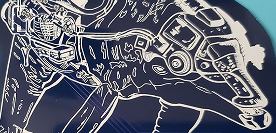
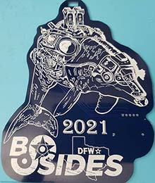
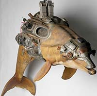
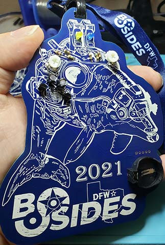
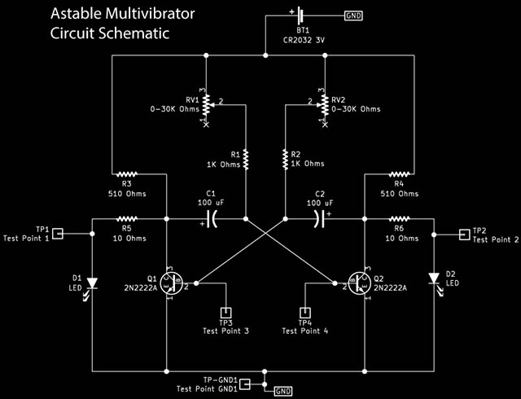

# Astable Badge

Welcome to the 3d6 Badge website.

This is where you will find information about the 3d6 badge and its repository.

-- [@alt_bier](https://twitter.com/alt_bier)  - [My Contact Info](https://gowen.net/about)

---

# Badge Kit Instructions

If you are looking for what comes in the badge kit or instructions on how to build the badge, those details are here: [Badge Kit](badgekit.md)

# Concept

The concept for this badge started [@CyberLowdown](https://twitter.com/CyberLowdown) asking me if I would be willing to do the badge for the BSidesDFW 2021 conference and with [@0isac0](https://twitter.com/0isac0) asking me if we can do a [Johnny Mnemonic](https://www.imdb.com/title/tt0113481/) theme since that movie takes place in 2021.
After much research I settled on a Cyber-Dolphin for the principal focus of the badge.

Given how the global chip shortages affected my recent Defcon badge I needed a circuit design that would flash some LEDs without the use of an IC chip.  This is what drove the circuit design.

Another design factor was that I wanted to make it a learning badge (learn soldering and electronics).  I've had great feedback on my other learning badges and I thought this would be a great draw to the BSidesDFW Hardware Hacking Village (which I would be running) to help people build their badges.

## Art

The badge art using a Johnny Mnemonic theme had me stumped on what to do since I did not just want to put Keanu Reeves face on a PCB (plus that's been done before).

So I did some research online and still had nothing.  I then reached out to some other badge makers and the idea of the Cyborg or Cyber Dolphin was mentioned.  It had been a long time since I watched that movie and didn't remember a Dolphin so I re-watched it and sure enough it was there.  

I loved the aesthetic and the Cyber-Dolphin badge art was born.

All of the Art files including the Adobe Illustrator files and various exported formats are available in the [art directory](https://github.com/gowenrw/astable_badge/tree/main/art) of this repository.

# Details

I wanted to make this a learn to solder and learn electronics badge.
All of the components are Through Hole type to meet the learn to solder goal.
The circuit needed to be complex enough to blink some LEDs without using an IC chip but simple enough for people to easily see what it is doing to learn from it.
The Astable Multivibrator circuit was perfect to meet the learn electronics goal.

## Astable Multivibrator

The Astable Multivibrator is a type of transistor switching circuit that has NO stable output states as it changes from one state to the other all the time.

The astable circuit consists of two switching transistors getting feedback from two time delay capacitor-resistor couplings.
This allows oscillation between the two states with no external triggering to produce the change in state.

On this badge I opted to introduce variable resistors (Rheostats) into the time delay capacitor-resistor couplings to allow for the speed of the state changes to be adjusted.
I added LEDs to the outputs of this circuit providing visual representation of the circuit state changes (and blinky lights).
I also added test points to the PCB so that the alternating square waves produced by this circuit could be observed with a cheap logic analyzer.

Astable Multivibrator Circuit Schematic

## EDA

The electronic design automation program used for this badge is KiCad.

I took great care to include and use local library files for all the schematic objects, footprints, and 3d models used in this badge.  
This way you don't have to worry about not having a file that KiCad depreciates at some point in the future.

All of the EDA files including the Gerber output files I used to have the badge manufactured are available in the [badge eda directory](https://github.com/gowenrw/astable_badge/tree/main/eda/astable_badge) of this repository.
